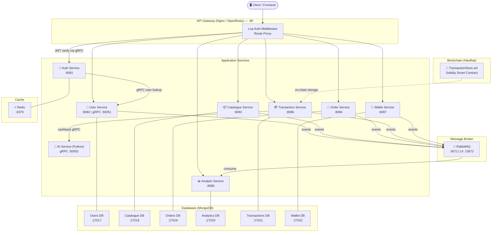

# 🛒 Produify — Microservices POS Platform

> A fully containerized, event-driven Point-of-Sale (POS) backend built with a microservices architecture, featuring blockchain transaction storage, AI-powered cashback, and real-time analytics.

---

## 📐 Architecture Overview



---

## 🗂️ Project Structure

```
produify-microservices/
│
├── services/                    # All microservices
│   ├── api-gateway/             # Nginx/OpenResty — reverse proxy + auth
│   ├── auth-service/            # JWT auth, session management
│   ├── user-service/            # User CRUD + gRPC server
│   ├── catalogue-service/       # Product/item catalogue
│   ├── order-service/           # Order management
│   ├── analytic-service/        # Business analytics (event consumer)
│   ├── transaction-service/     # Payment transactions + blockchain
│   ├── wallet-service/          # Digital wallet / cashback wallet
│   └── ai-service/              # Python gRPC — AI cashback engine
│
├── shared/
│   ├── libraries/               # Shared proto files
│   │   ├── user.proto           # User gRPC contract
│   │   └── cashback.proto       # Cashback gRPC contract
│   └── configurations/          # Shared config templates
│
├── infrastructure/
│   ├── docker-compose.yml       # Full stack orchestration
│   ├── docker-compose.override.yml
│   └── monitoring/              # Observability config (future)
│
├── smartcontract/               # Hardhat blockchain project
│   ├── contracts/
│   │   └── TransactionStore.sol # On-chain transaction ledger
│   ├── scripts/                 # Deploy scripts
│   └── hardhat.config.js
│
└── collections/                 # API test collections (Postman/Bruno)
```

---

## 🧩 Services Reference

| Service | Port | Protocol | Database | Description |
|---|---|---|---|---|
| **API Gateway** | `80` | HTTP | — | Nginx/OpenResty reverse proxy with Lua JWT middleware |
| **Auth Service** | `8081` | REST | Redis | Login, register, token refresh, logout |
| **User Service** | `8082` / `50051` | REST + gRPC | MongoDB :27017 | User profiles, gRPC server for inter-service calls |
| **Catalogue Service** | `8083` | REST | MongoDB :27018 | Products, categories, inventory |
| **Order Service** | `8084` | REST | MongoDB :27019 | Order lifecycle management |
| **Analytic Service** | `8085` | REST | MongoDB :27020 | Aggregated reports, event-driven data consumer |
| **Transaction Service** | `8086` | REST | MongoDB :27021 | Payments, receipts, blockchain recording |
| **Wallet Service** | `8087` | REST | MongoDB :27022 | Cashback wallet, balance management |
| **AI Service** | `50052` | gRPC (Python) | — | AI-powered cashback calculation engine |

### Infrastructure

| Component | Port | Description |
|---|---|---|
| **RabbitMQ** | `5672` / `15672` | Async event messaging between services |
| **Redis** | `6379` | Token cache, session store |
| **MongoDB** × 6 | `27017–27022` | Per-service isolated databases |
| **Hardhat** | — | Local blockchain for smart contract dev/test |

---

## ⚙️ Tech Stack

| Layer | Technology |
|---|---|
| **Runtime** | Node.js ≥ 18, Python 3 |
| **API Framework** | Express.js |
| **API Gateway** | OpenResty (Nginx + Lua) |
| **Inter-service RPC** | gRPC (Protocol Buffers) |
| **Async Messaging** | RabbitMQ (AMQP) |
| **Auth** | JWT + bcrypt |
| **Cache** | Redis |
| **Database** | MongoDB 7 |
| **Blockchain** | Solidity + Hardhat |
| **Containerization** | Docker + Docker Compose |
| **Testing** | Jest + Supertest |

---

## 🚀 Quick Start

### Prerequisites
- [Docker Desktop](https://www.docker.com/products/docker-desktop/) installed and running
- Git

### 1. Clone the repository
```bash
git clone <your-repo-url>
cd produify-microservices
```

### 2. Set up environment variables
```bash
# Copy example env file (if present)
cp smartcontract/.env.example smartcontract/.env
```

### 3. Start all services
```bash
cd infrastructure
docker compose up --build
```

### 4. Verify services are running
```bash
docker compose ps
```

---

## 🌐 Key Endpoints (via Gateway on :80)

| Method | Path | Service | Description |
|---|---|---|---|
| `POST` | `/api/auth/login` | Auth | Login |
| `POST` | `/api/auth/register` | Auth | Register |
| `GET` | `/api/users/me` | User | Current user profile |
| `GET` | `/api/catalogue/products` | Catalogue | List products |
| `POST` | `/api/orders` | Order | Create an order |
| `GET` | `/api/analytics/summary` | Analytic | Business summary |
| `POST` | `/api/transactions` | Transaction | Record a payment |
| `GET` | `/api/wallet/balance` | Wallet | Get wallet balance |

> All routes (except `/auth/*`) require a valid **Bearer token** in the `Authorization` header.

---

## 📡 Inter-Service Communication

```
Auth ──gRPC──► User          (validate user identity)
Transaction ──gRPC──► AI    (calculate cashback amount)
User/Order/Transaction/Wallet ──AMQP──► RabbitMQ ──► Analytic
```

- **gRPC** is used for low-latency, synchronous service-to-service calls
- **RabbitMQ** is used for asynchronous, fire-and-forget event publishing
- Proto files are shared via `shared/libraries/`

---

## ⛓️ Smart Contract

`TransactionStore.sol` is a Solidity contract deployed on a local Hardhat blockchain.  
It provides an **immutable on-chain record** of completed transactions.

```bash
# In smartcontract/
npm install
npx hardhat compile
npx hardhat run scripts/deploy.js --network localhost
```

---

## 🧪 Running Tests

Each service has its own test suite:

```bash
# Example: auth-service
cd services/auth-service
npm test

# With coverage
npm run test:coverage
```

---

## 📦 Docker Useful Commands

```bash
# Start everything
docker compose -f infrastructure/docker-compose.yml up -d

# Stop everything
docker compose -f infrastructure/docker-compose.yml down

# View logs for a specific service
docker logs pos-auth-service -f

# Rebuild a single service
docker compose -f infrastructure/docker-compose.yml up --build auth-service
```

---

## 🔑 Environment Variables

Key variables used across services (see each service's `.env.example`):

| Variable | Description |
|---|---|
| `JWT_SECRET` | Secret key for JWT signing |
| `MONGODB_URI` | MongoDB connection string |
| `REDIS_URL` | Redis connection URL |
| `RABBITMQ_URL` | RabbitMQ AMQP URL |
| `USER_SERVICE_GRPC_URL` | gRPC address for User Service |
| `AI_SERVICE_GRPC_URL` | gRPC address for AI Service |
| `MONGO_ROOT_USERNAME` | MongoDB admin username |
| `MONGO_ROOT_PASSWORD` | MongoDB admin password |

---

## 📄 License

MIT — see individual service `package.json` files for details.
